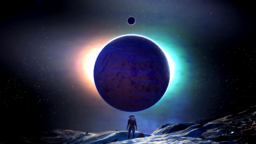
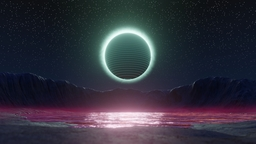

Extras of [`horiceon`](https://github.com/shiftgeist/horiceon).

## Credit

**I do not claim rights to any of these works.** If you want to be credited with your work, or you want me to remove your work, feel free to contact me or submit a pull request and I'll take care of it.

### Wallpapers

| Image                                                                                                                              | Author                                             | Source                                                                                           |
| ---------------------------------------------------------------------------------------------------------------------------------- | -------------------------------------------------- | ------------------------------------------------------------------------------------------------ |
| [](dot_local/share/wallpapers/planet_hopping@3840x2160.png)   | [SpongeN0b](https://old.reddit.com/user/SpongeN0b) | [/r/NoMansSkyTheGame](https://www.reddit.com/r/NoMansSkyTheGame/comments/j0mqvd/planet_hopping/) |
| [](dot_local/share/wallpapers/electric_impact@3840x2160.jpg) | [DVT01](https://old.reddit.com/user/DVT01)         | [/r/wallpaper](https://old.reddit.com/r/wallpaper/comments/ecstth/3840x2160_electric_impact/)    |

## Development

Previews created with:

```
convert dot_local/share/wallpapers/$FILE_NAME -resize 256x256 dot_local/share/wallpapers/previews/$FILE_NAME
```
